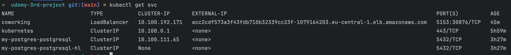
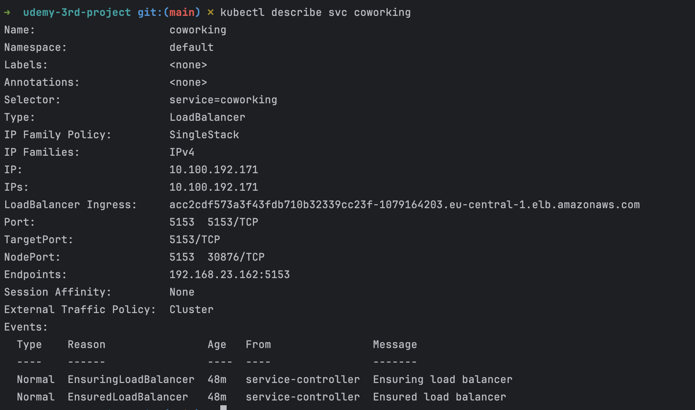
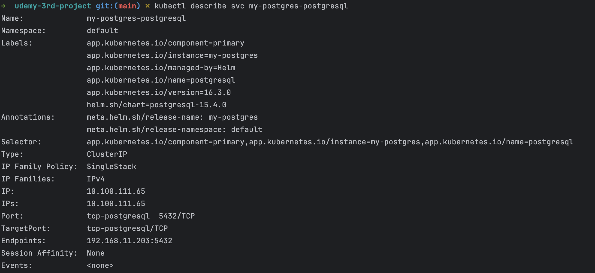
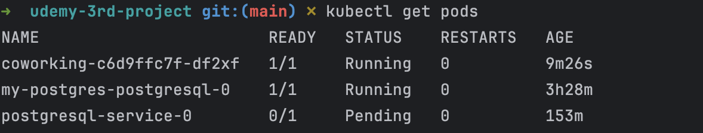
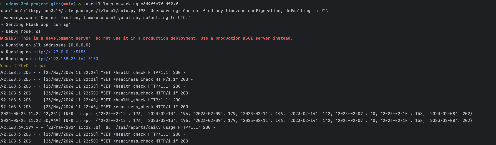
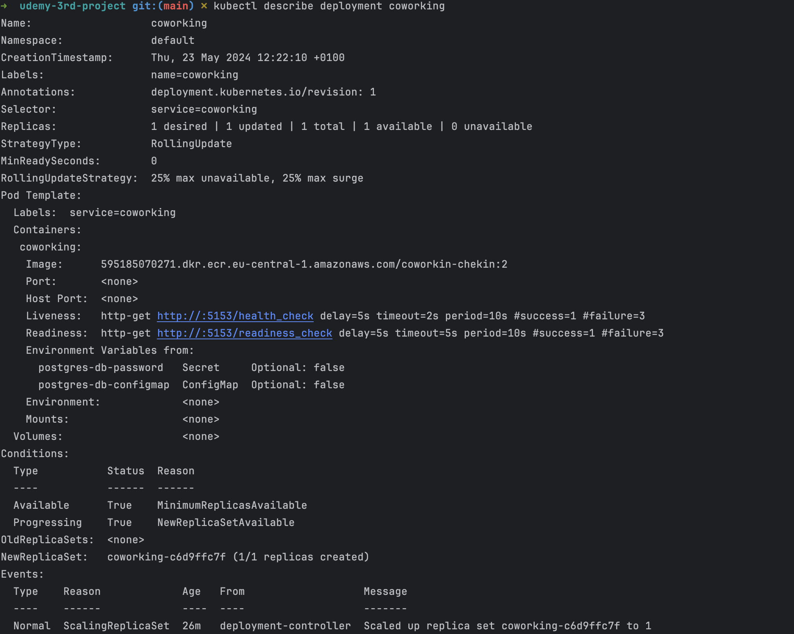

# Coworking Space Service Extension
The Coworking Space Service is a set of APIs that enables users to request one-time tokens and administrators to authorize access to a coworking space. This service follows a microservice pattern and the APIs are split into distinct services that can be deployed and managed independently of one another.

For this project, you are a DevOps engineer who will be collaborating with a team that is building an API for business analysts. The API provides business analysts basic analytics data on user activity in the service. The application they provide you functions as expected locally and you are expected to help build a pipeline to deploy it in Kubernetes.

## Getting Started

### Dependencies
#### Local Environment
1. Python Environment - run Python 3.6+ applications and install Python dependencies via `pip`
2. Docker CLI - build and run Docker images locally
3. `kubectl` - run commands against a Kubernetes cluster
4. `helm` - apply Helm Charts to a Kubernetes cluster

#### Remote Resources
1. AWS CodeBuild - build Docker images remotely
2. AWS ECR - host Docker images
3. Kubernetes Environment with AWS EKS - run applications in k8s, 2 nodes of t3.small is more than enough
```bash
eksctl create cluster --name <cluster_name> --region <region> --nodegroup-name <nodesgroup_name> --node-type t3.small --nodes 2 --nodes-min 2 --nodes-max 2
```
4. AWS CloudWatch - monitor activity and logs in EKS
5. GitHub - pull and clone code

### Setup
#### 1. Configure a Database
Set up a Postgres database using a Helm Chart.

1. Set up Bitnami Repo
```bash
helm repo add bitnami https://charts.bitnami.com/bitnami
```

2. Install PostgreSQL Helm Chart
```bash
helm install postgresql-service bitnami/postgresql --set primary.persistence.enabled=false
```

This should set up a Postgres deployment at `postgresql-service.default.svc.cluster.local` in your Kubernetes cluster. You can verify it by running `kubectl svc`

By default, it will create a username `postgres`. The password can be retrieved with the following command:
```bash
export POSTGRES_PASSWORD=$(kubectl get secret --namespace default my-postgres-postgresql  -o jsonpath="{.data.postgres-password}" | base64 -d)

echo $POSTGRES_PASSWORD 
```

<sup><sub>* The instructions are adapted from [Bitnami's PostgreSQL Helm Chart](https://artifacthub.io/packages/helm/bitnami/postgresql).</sub></sup>

3. Test Database Connection
The database is accessible within the cluster. This means that when you will have some issues connecting to it via your local environment. You can either connect to a pod that has access to the cluster _or_ connect remotely via [`Port Forwarding`](https://kubernetes.io/docs/tasks/access-application-cluster/port-forward-access-application-cluster/)

* Connecting Via Port Forwarding
```bash
kubectl port-forward --namespace default svc/my-postgres-postgresql 5432:5432 &
PGPASSWORD= psql --host 127.0.0.1 -U postgres -d postgres -p 5432
```

* Connecting Via a Pod
```bash
kubectl exec -it my-postgres-postgresql-0 -- bash
PGPASSWORD="$POSTGRES_PASSWORD" psql postgres://postgres@my-postgres-postgresql:5432/postgres -c <COMMAND_HERE>
```

4. Run Seed Files
We will need to run the seed files in `db/` in order to create the tables and populate them with data.

```bash
export PGPASSWORD=Gv1cUjlBOM
PGPASSWORD="$POSTGRES_PASSWORD" psql --host 127.0.0.1 -U postgres -d postgres -p 5432 < db/<NAME_OF_SEED_FILE>
```

### 2. Running the Analytics Application Locally
In the `analytics/` directory:

1. Install dependencies
```bash
pip install -r analytics/requirements.txt
```
2. Run the application (see below regarding environment variables)
```bash
DB_USERNAME=<DB_USERNAME> DB_PASSWORD=<DB_PASSWORD> python analytics/app.py
```

There are multiple ways to set environment variables in a command. They can be set per session by running `export KEY=VAL` in the command line or they can be prepended into your command.

* `DB_USERNAME`
* `DB_PASSWORD`
* `DB_HOST` (defaults to `127.0.0.1`)
* `DB_PORT` (defaults to `5432`)
* `DB_NAME` (defaults to `postgres`)

If we set the environment variables by prepending them, it would look like the following:
```bash
DB_USERNAME=username_here DB_PASSWORD=password_here python app.py
```
The benefit here is that it's explicitly set. However, note that the `DB_PASSWORD` value is now recorded in the session's history in plaintext. There are several ways to work around this including setting environment variables in a file and sourcing them in a terminal session.

3. Verifying The Application
* Generate report for check-ins grouped by dates
`curl <ENDPOINT>/api/reports/daily_usage`

* Generate report for check-ins grouped by users
`curl <ENDPOINT>/api/reports/user_visits`


## 3. Deploy the Analytics Application 

* Create a Dockerfile for the Python Application
Dockerfile
[Dockerfile](./Dockerfile)

* Write a Build Pipeline with AWS CodeBuild

buildspec File
[buildspec](./buildspec.yml)

* Create CodeBuild and add the necessary ECR permissions to CodeBuild iam Role


* Deploy the application
   ```bash
   kubectl apply -f deployment/
   ```
* Test the deployment
Get the svc External-IP and run the curl command. Per example:
```bash
   kubectl get svc
   curl acc2cdf573a3f43fdb710b32339cc23f-1079164203.eu-central-1.elb.amazonaws.com/api/reports/daily_usage
 ```

## Create Kubernetes Service and Deployment
1. List Services
   ```bash
   kubectl get svc
   kubectl describe svc
   ```
   List Services
   
   List Describe Services Kubernetes
   
   


3. List Pods
   ```bash
   kubectl get pods
   kubectl describe pods
   kubectl logs <pod_name>
   ```
   List Pods
   
   Get Pods Logs for debug
   
   
4. List Deployments
   ```bash
   kubectl get deployments
   kubectl describe deployment project3-api
   ```
   List Describe Deployments
   

